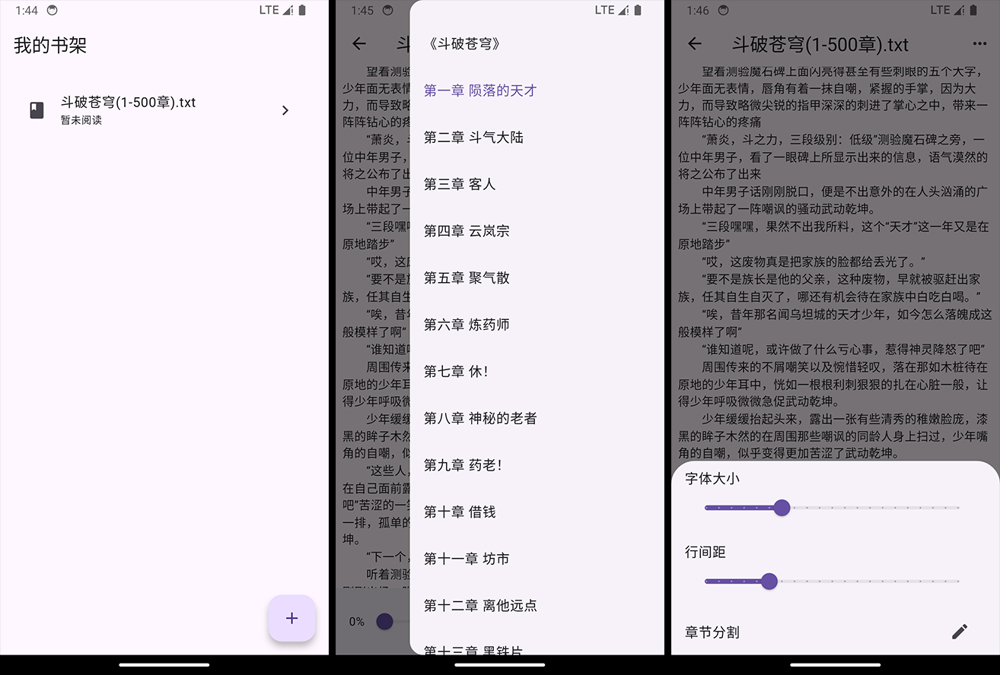

# local_novel_reader

一款轻量级本地小说阅读器。

## 开发背景

每次我看~~笔趣阁~~本地小说，用浏览器或者其他小说软件打开时，总会有开屏之类的广告，我只想简简单单地看小说。

## 项目进度

现在基本功能已经实现，后续会继续完善其他方面(maybe)

- 支持导入本地TXT格式小说文件
- 自动分章节解析（不满足的话需要自己设置正则）
- 记录阅读进度
- 支持书架管理
- 支持浅色/深色主题
- Android平台，其他的没试过

## 软件截图

  

